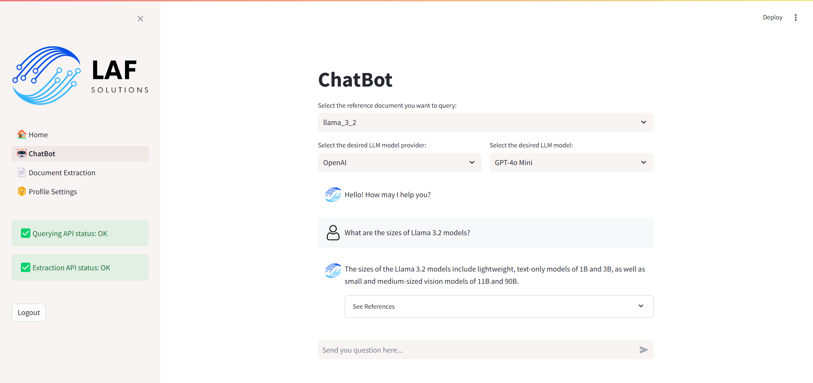

# Projeto de Protótipo de LLM e Microsserviços para Hotmart
Este projeto é parte do desafio proposto pela Hotmart, focado na criação de um protótipo de Large Language Model (LLM) com base em conhecimento.

## Descrição do Projeto
O objetivo deste projeto é desenvolver dois microsserviços:

1. **Microsserviço de Processamento e Armazenamento**:
    * Recebe um documento de texto extraído da página: [Como funciona a Hotmart?](https://hotmart.com/pt-br/blog/como-funciona-hotmart)
    * Realiza o processamento desse documento e o armazena em um Vector Database open-source.

2. **Microsserviço de Busca e Resposta**:
    * Dado um texto de entrada no formato de pergunta, busca no Vector Database os trechos relevantes.
    * Utiliza um LLM para gerar uma resposta com base nos trechos recuperados.

**EXTRA:** Além disso, de forma a desenvolver uma solução completa e um protótipo funcional, o objetivo extra do projeto é fornecer uma interface para interação do usuário com os microsserviços através de um ChatBot.

## Tecnologias Utilizadas
* **FastAPI**: Framework para desenvolvimento de APIs em Python.
* **Docker**: Para containerizar os microsserviços e o Vector Database.
* **LlamaIndex**: Biblioteca de indexação vetorial open-source para armazenar e recuperar informações relevantes de documentos de texto.
* **Qdrant - Vector Database**: Vector Database open-source para armazenar e recuperar informações relevantes.
* **OpenAI API**: Utilizada para geração de respostas usando Large Language Models (LLM) proprietários da empresa OpenAI.
* **Replicate API**: Utilizada para geração de respostas usando LLMs open-source.
* **Streamlit**: Framework em Python para criação de aplicações web interativas, utilizado para desenvolver a interface de usuário que interage com os microsserviços e visualiza as respostas geradas pelos LLMs e dados indexados no Vector Database.

## Como Executar
Para executar este projeto localmente via Docker Compose, siga os passos abaixo:

1. **Configuração inicial**:
* Clone este repositório em sua máquina local.

2. **Configuração do ambiente**:
* Certifique-se de ter o Docker instalado em seu sistema.

3. **Construir e iniciar os serviços**:
* Navegue até o diretório raiz do projeto onde está o arquivo `docker-compose.yaml`.
* Execute o seguinte comando:

```bash
docker-compose up --build
```

## Testando os microsserviços
### FastAPI Swagger
* O framework FastAPI automaticamente gera uma interface Swagger em seu endpoint `docs/`

#### API de Extração de Documentos
* Pode ser acessada através da URL: `http://localhost:8000/`


#### API de Busca e Resposta
* Pode ser acessada através da URL: `http://localhost:8001/`


### Interface Streamlit
* A interface criada através da biblioteca Streamlit pode ser acessada através da URL: `http://localhost:8501/`

#### Login
* Página de autenticação do usuário
* Como padrão, a configuração do usuário teste encontra-se descrita no arquivo `src/streamlit/authenticator/config.yaml`
* As credencias do usuário padrão são:
    * Usuário: `teste`
    * Senha: `teste`


#### Home
* Página inicial com uma breve descrição do projeto


#### ChatBot
* ChatBot integrado com a `API de Busca e Resposta`
* Inicialmente, seleciona-se o documento de referência desejado dentre a lista de documentos cadastrados
* Então, seleciona-se o LLM desejado dentre a lista de opções cadastradas. A partir da integração com os serviços da OpenAI e do Replicate, estão disponíveis os seguintes modelos:
    * **OpenAI**: GPT-3.5 Turbo, GPT-4o
    * **Meta**: Llama 2 7B Chat, Llama 2 13B Chat, Llama 2 70B Chat, Llama 3 8B Instruct, Llama 3 70B Instruct
    * **MistralAI**: Mistral 7B v0.1, Mistral 7B Instruct v0.2, Mixtral 8x7B Instruct v0.1



#### Extração de Documentos
* Interface para extração de documentos integrada com a `API de Extração de Documentos`
* Nela, é possível a extração de documentos a partir de URL ou a partir do upload de arquivos


#### Ajustes de Conta
* Página para redefinição de senha e atualização de dados do usuário


### Dashboard Qdrant
* Dashboard do Vector Database Qdrant para visualização das `collections` cadastradas


### Scripts de Exemplo
* Utilize os exemplos de entrada fornecidos na pasta `examples/` para testar as APIs. Este são: `examples_pipeline.py` e `examples_pipeline.sh`.
* Nele, há exemplos de entrada para cada microsserviço, incluindo comandos cURL e scripts de shell para testes e reprodutibilidade.