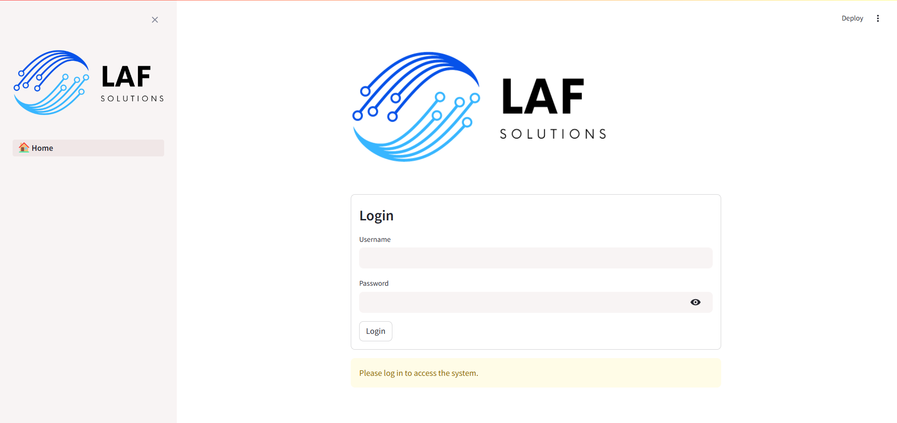
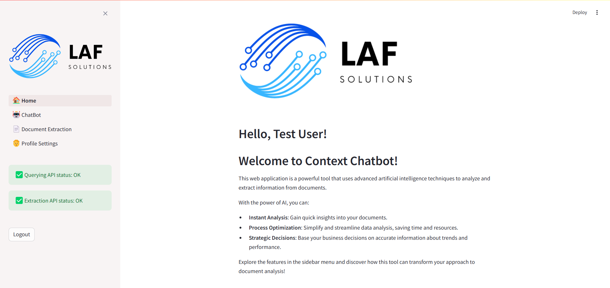

# Knowledge-Based LLM Prototype - Context Chatbot

<div align="center">
    
</div>

This project focuses on creating a prototype of a Knowledge-Based Large Language Model (LLM) ChatBot.

## Table of Contents

1. [Project Description](#project-description)
    * [Processing and Storage Microservice](#processing-and-storage-microservice)
    * [Retrieve and Query Microservice](#retrieve-and-query-microservice)
2. [Technologies Used](#technologies-used)
3. [How to Run](#how-to-run)
    * [Initial Setup](#initial-setup)
    * [Environment Setup](#environment-setup)
    * [Set Environment Variables](#set-environment-variables)
    * [Build and Start the Services](#build-and-start-the-services)
4. [Testing the Microservices](#testing-the-microservices)
    * [FastAPI Swagger](#fastapi-swagger)
        * [Document Extraction API](#document-extraction-api)
        * [Querying and Response API](#querying-and-response-api)
    * [Streamlit Interface](#streamlit-interface)
        * [Login](#login)
        * [Home](#home)
        * [ChatBot](#chatbot)
        * [Document Extraction](#document-extraction)
        * [Account Settings](#account-settings)
    * [Qdrant Dashboard](#qdrant-dashboard)
    * [Example Scripts](#example-scripts)
5. [GitHub Actions](#github-actions)


## Project Description
The goal of this project is to develop two microservices:

1. **Processing and Storage Microservice**:
    * Receives a text document extracted from a file or URL, e.g., [Llama 3.2: Revolutionizing edge AI and vision with open, customizable models](https://ai.meta.com/blog/llama-3-2-connect-2024-vision-edge-mobile-devices/).
    * Processes the document and stores it in an open-source Vector Database.
    * Designed as an API to facilitate integration and scalability.

2. **Retrieve and Query Microservice**:
    * Given an input question in text format, searches the Vector Database for relevant chunks.
    * Uses an LLM to generate a response based on the retrieved chunks.
    * Designed as an API to facilitate integration and scalability.

**EXTRA:** Additionally, to deliver a complete solution and a functional prototype, the extra objective of this project is to provide a user interface for interacting with the microservices via a ChatBot.

## Technologies Used
* **FastAPI**: A framework for developing APIs in Python.
* **Docker**: Used to containerize the microservices and the Vector Database.
* **LlamaIndex**: An open-source vector indexing library for storing and retrieving relevant information from text documents.
* **Qdrant - Vector Database**: An open-source Vector Database for storing and retrieving relevant information.
* **OpenAI API**: Used for generating responses with OpenAI's proprietary Large Language Models (LLMs).
* **Replicate API**: Used for generating responses with open-source LLMs.
* **Streamlit**: A Python framework for building interactive web applications, used to develop the user interface for interacting with the microservices and visualizing the responses generated by the LLMs and the data indexed in the Vector Database.

## How to Run
To run this project locally via Docker Compose, follow the steps below:

1. **Initial Setup**:
* Clone this repository to your local machine.
```sh
git clone https://github.com/lafidalgo/context-chatbot.git
cd context-chatbot
```

2. **Environment Setup**:
* Ensure you have Docker installed on your system.

3. **Set Environment Variables**:
* Create a `.env` file in the root of the project and define the following environment variables:

    **Document Extraction API and Querying API**:
    - `OPENAI_API_KEY`: **(REQUIRED)** API Key to access OpenAI services, including embedding generation and the use of their LLMs.
    - `OPENAI_EMBED_MODEL`: Name of the embedding model used to convert texts into numerical vectors via the OpenAI API. Default value: `text-embedding-3-large`.
    - `REPLICATE_API_TOKEN`: API token for authenticating with the Replicate service to use open-source LLMs.
    - `QDRANT_CLUSTER_URL`: URL of the Qdrant database cluster used to store and retrieve document embedding vectors. Default value: `http://qdrant-context-chatbot:6333`.
    - `QDRANT_API_KEY`: API Key for authenticating with the Qdrant service.

    **Streamlit Interface**:
    - `DOCUMENT_EXTRACTION_API_URL`: URL of the Document Extraction API. Default value: `http://document-extraction-context-chatbot:8000`.
    - `DOCUMENT_QUERYING_API_URL`: URL of the Querying API. Default value: `http://document-querying-context-chatbot:8000`.
    - `STREAMLIT_AUTHENTICATOR_CONFIG_PATH`: Path to the Streamlit authenticator configuration file, which manages user authentication in the interface. Default value: `src/streamlit/authenticator/config.yaml`.

* **NOTE**: The only **required** environment variable is `OPENAI_API_KEY`. All other variables are optional.

4. **Build and Start the Services**:
* Navigate to the root directory of the project where the `docker-compose.yaml` file is located.
* Run the following command:

```bash
docker-compose up --build
```

## Testing the Microservices
### FastAPI Swagger
* The FastAPI framework automatically generates a Swagger interface at the `docs/` endpoint.

#### Document Extraction API
* Can be accessed via URL: `http://localhost:8000/`
* The API includes endpoints related to:
    * **API Status**: Check the API's status.
    * **Qdrant Integration**: Features for integrating with the Qdrant Vector Database.
    * **LlamaIndex Integration**: Features for extracting documents from a URL or file upload.


#### Querying and Response API
* Can be accessed via URL: `http://localhost:8001/`
* The API includes endpoints related to:
    * **API Status**: Check the API's status.
    * **Qdrant Integration**: Features for integrating with the Qdrant Vector Database.
    * **LlamaIndex Integration**: Features for querying and generating responses based on a question and a reference document.


### Streamlit Interface
* The interface created using the Streamlit library can be accessed via URL: `http://localhost:8501/`

#### Login
* User authentication page.
* By default, the `Test User` configuration is described in the file `src/streamlit/authenticator/config.yaml`.
* The `Test User` credentials are:
    * Username: `test`
    * Password: `test`



#### Home
* Homepage with a brief description of the project.



#### ChatBot
* ChatBot integrated with the `Querying and Response API`.
* First, the desired reference document is selected from the list of documents stored in the Vector Database.
* Then, the desired LLM is chosen from the list of available options. Through integration with OpenAI and Replicate services, the following models are available (configured via the file `src\api\shared\models\llm.json`):
    * **OpenAI**: GPT-3.5 Turbo, GPT-4o, GPT-4o Mini.
    * **Meta**: Llama 2 7B Chat, Llama 2 13B Chat, Llama 2 70B Chat, Llama 3 8B Instruct, Llama 3 70B Instruct.
    * **MistralAI**: Mistral 7B Instruct v0.2, Mixtral 8x7B Instruct v0.1.
* **NOTE**: The prompts were designed with OpenAI's LLMs in mind. For optimal performance, it is recommended to use the models `GPT-3.5 Turbo`, `GPT-4o`, or `GPT-4o Mini`.


#### Document Extraction
* Interface for document extraction integrated with the `Document Extraction API`.
* Allows document extraction from a URL or file upload.


#### Account Settings
* Page for resetting passwords and updating user details.


### Qdrant Dashboard
* Qdrant Vector Database dashboard for viewing registered `collections`.
* Can be accessed via URL: `http://localhost:6333/dashboard`.


### Example Scripts
* Use the input examples provided in the `examples/` folder to test the APIs. These include `examples_pipeline.py` and `examples_pipeline.sh`.
* The folder contains input examples for each microservice, including cURL commands and shell scripts for testing and reproducibility.

## GitHub Actions
* This project automatically generates Docker images using GitHub Actions. These images are built and published to GitHub Packages whenever a new commit is made to the `main` branch.
* Additionally, the GitHub Actions workflow enables the automatic deployment of the images to the [Render](https://render.com/) hosting service through webhooks.
* To use GitHub Actions, you need to configure the following `Repository secrets`:
    * `GH_PAT`: GitHub Personal Access Token required for authentication and publishing Docker images to GitHub Packages.
    * `RENDER_DEPLOY_HOOK_DOCUMENT_EXTRACTION_API`: Webhook URL provided by Render for the automatic update of the Document Extraction API.
    * `RENDER_DEPLOY_HOOK_DOCUMENT_QUERYING_API`: Webhook URL provided by Render for the automatic update of the Document Querying API.
    * `RENDER_DEPLOY_HOOK_STREAMLIT`: Webhook URL provided by Render for the automatic update of the Streamlit frontend.