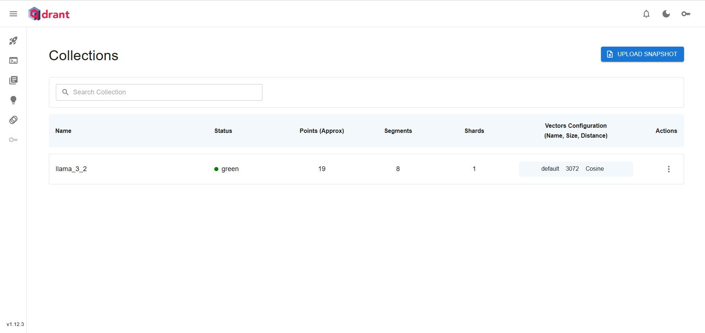

# Protótipo de LLM com base em Conhecimento - Hotmart


Este projeto é parte do desafio proposto pela Hotmart, focado na criação de um protótipo de Large Language Model (LLM) com base em conhecimento.

## Descrição do Projeto
O objetivo deste projeto é desenvolver dois microsserviços:

1. **Microsserviço de Processamento e Armazenamento**:
    * Recebe um documento de texto extraído da página: [Como funciona a Hotmart?](https://hotmart.com/pt-br/blog/como-funciona-hotmart)
    * Realiza o processamento desse documento e o armazena em um Vector Database open-source.
    * Desenvolvido como uma API para facilitar a integração e a escalabilidade.

2. **Microsserviço de Busca e Resposta**:
    * Dado um texto de entrada no formato de pergunta, busca no Vector Database os trechos relevantes.
    * Utiliza um LLM para gerar uma resposta com base nos trechos recuperados.
    * Desenvolvido como uma API para facilitar a integração e a escalabilidade.

**EXTRA:** Além disso, de forma a desenvolver uma solução completa e um protótipo funcional, o objetivo extra do projeto é fornecer uma interface para interação do usuário com os microsserviços através de um ChatBot.

## Tecnologias Utilizadas
* **FastAPI**: Framework para desenvolvimento de APIs em Python.
* **Docker**: Para containerizar os microsserviços e o Vector Database.
* **LlamaIndex**: Biblioteca de indexação vetorial open-source para armazenar e recuperar informações relevantes de documentos de texto.
* **Qdrant - Vector Database**: Vector Database open-source para armazenar e recuperar informações relevantes.
* **OpenAI API**: Utilizada para geração de respostas usando Large Language Models (LLM) proprietários da empresa OpenAI.
* **Replicate API**: Utilizada para geração de respostas usando LLMs open-source.
* **Streamlit**: Framework em Python para criação de aplicações web interativas, utilizado para desenvolver a interface de usuário que interage com os microsserviços e visualiza as respostas geradas pelos LLMs e dados indexados no Vector Database.

## Como Executar
Para executar este projeto localmente via Docker Compose, siga os passos abaixo:

1. **Configuração inicial**:
* Clone este repositório em sua máquina local.
```sh
git clone https://github.com/lafidalgo/hotmart-challenge.git
cd hotmart-challenge
```

2. **Configuração do ambiente**:
* Certifique-se de ter o Docker instalado em seu sistema.

3. **Definição das variáveis de ambiente**:
* Crie um arquivo .env na raiz do projeto e defina as seguintes variáveis de ambiente:

    **API de Extração de Documentos e API de Busca e Resposta**:
    - `OPENAI_API_KEY`: **(OBRIGATÓRIA)** API Key para acessar os serviços da OpenAI, incluindo a geração de embeddings e a utilização de seus LLMs. 
    - `OPENAI_EMBED_MODEL`: Nome do modelo de embeddings utilizado para transformar textos em vetores numéricos pela API da OpenAI. Valor padrão: `text-embedding-3-large`
    - `REPLICATE_API_TOKEN`: Token de API para autenticação com o serviço Replicate, para utilização de LLMs open-source.
    - `QDRANT_CLUSTER_URL`: URL do cluster do banco de dados Qdrant usado para armazenar e recuperar vetores de embeddings de documentos. Valor padrão: `http://qdrant-hotmart-challenge:6333`
    - `QDRANT_API_KEY`: API Key para autenticação com o serviço Qdrant.

    **Interface Streamlit**:
    - `DOCUMENT_EXTRACTION_API_URL`: URL da API de Extração de Documentos. Valor padrão: `http://document-extraction-hotmart-challenge:8000`
    - `DOCUMENT_QUERYING_API_URL`: URL da API de Busca e Resposta. Valor padrão: `http://document-querying-hotmart-challenge:8000`
    - `STREAMLIT_AUTHENTICATOR_CONFIG_PATH`: Caminho para o arquivo de configuração do autenticador do Streamlit, que gerencia a autenticação dos usuários na interface. Valor padrão: `src/streamlit/authenticator/config.yaml`

* **ATENÇÃO**: A única variável de ambiente que deve ser **obrigatoriamente** definida é a `OPENAI_API_KEY`. As demais variáveis são opcionais.

4. **Construir e iniciar os serviços**:
* Navegue até o diretório raiz do projeto onde está o arquivo `docker-compose.yaml`.
* Execute o seguinte comando:

```bash
docker-compose up --build
```

## Testando os microsserviços
### FastAPI Swagger
* O framework FastAPI automaticamente gera uma interface Swagger em seu endpoint `docs/`

#### API de Extração de Documentos
* Pode ser acessada através da URL: `http://localhost:8000/`
* A API possui endpoints relacionados com:
    * **API Status**: Verificação do status da API.
    * **Qdrant Integration**: Funcionalidades de integração com o Vector Database Qdrant.
    * **LlamaIndex Integration**: Funcionalidades para extração de documentos a partir de URL ou de upload de arquivo.


#### API de Busca e Resposta
* Pode ser acessada através da URL: `http://localhost:8001/`
* A API possui endpoints relacionados com:
    * **API Status**: Verificação do status da API.
    * **Qdrant Integration**: Funcionalidades de integração com o Vector Database Qdrant.
    * **LlamaIndex Integration**: Funcionalidades para busca e resposta a partir de uma pergunta e um documento de referência.


### Interface Streamlit
* A interface criada através da biblioteca Streamlit pode ser acessada através da URL: `http://localhost:8501/`

#### Login
* Página de autenticação do usuário
* Como padrão, a configuração do `Usuário Teste` encontra-se descrita no arquivo `src/streamlit/authenticator/config.yaml`
* As credencias do `Usuário Teste` são:
    * Usuário: `teste`
    * Senha: `teste`


#### Home
* Página inicial com uma breve descrição do projeto


#### ChatBot
* ChatBot integrado com a `API de Busca e Resposta`
* Inicialmente, seleciona-se o documento de referência desejado dentre a lista de documentos cadastrados no Vector Database
* Então, seleciona-se o LLM desejado dentre a lista de opções cadastradas. A partir da integração com os serviços da OpenAI e do Replicate, estão disponíveis os seguintes modelos:
    * **OpenAI**: GPT-3.5 Turbo, GPT-4o
    * **Meta**: Llama 2 7B Chat, Llama 2 13B Chat, Llama 2 70B Chat, Llama 3 8B Instruct, Llama 3 70B Instruct
    * **MistralAI**: Mistral 7B v0.1, Mistral 7B Instruct v0.2, Mixtral 8x7B Instruct v0.1
* **ATENÇÃO**: Os prompts foram desenvolvidos tendo como referência as LLMs da `OpenAI`. Sendo assim, recomenda-se a utilização dos modelos `GPT-3.5 Turbo` e `GPT-4o` para melhor performance. 


#### Extração de Documentos
* Interface para extração de documentos integrada com a `API de Extração de Documentos`
* Nela, é possível a extração de documentos a partir de URL ou a partir do upload de arquivos


#### Ajustes de Conta
* Página para redefinição de senha e atualização de dados do usuário


### Dashboard Qdrant
* Dashboard do Vector Database Qdrant para visualização das `collections` cadastradas



### Scripts de Exemplo
* Utilize os exemplos de entrada fornecidos na pasta `examples/` para testar as APIs. Este são: `examples_pipeline.py` e `examples_pipeline.sh`.
* Nele, há exemplos de entrada para cada microsserviço, incluindo comandos cURL e scripts de shell para testes e reprodutibilidade.

## GitHub Actions
* Este projeto gera automaticamente imagens Docker usando GitHub Actions. Essas imagens são construídas e publicadas no GitHub Packages sempre que um novo commit é feito na branch `main`.
* Além disso, o workflow do GitHub Actions permite a publicação automática das imagens no serviço de hospedagem [Render](https://render.com/) através de webhooks.
* Para utilizar o GitHub Actions, é necessário configurar os seguintes `Repository secrets`:
    * `GH_PAT`: Token de acesso pessoal (Personal Access Token) do GitHub, necessário para autenticação e publicação de imagens Docker no GitHub Packages.
    * `RENDER_DEPLOY_HOOK_DOCUMENT_EXTRACTION_API`: URL do webhook fornecido pelo Render para a atualização automática da API de Extração de Documentos.
    * `RENDER_DEPLOY_HOOK_DOCUMENT_QUERYING_API`: URL do webhook fornecido pelo Render para a atualização automática da API de Consulta de Documentos.
    * `RENDER_DEPLOY_HOOK_STREAMLIT`: URL do webhook fornecido pelo Render para a atualização automática do frontend Streamlit.